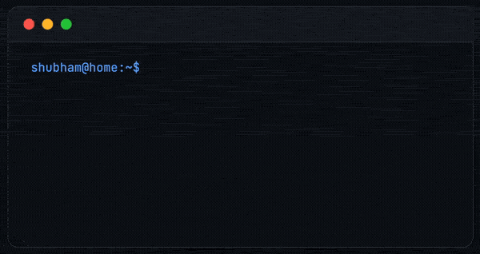
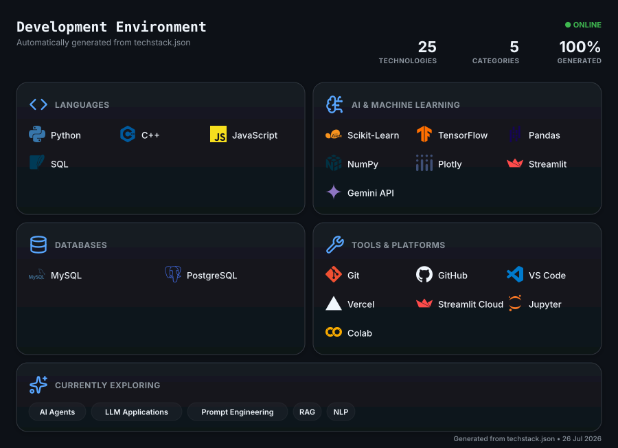

```txt
              .....,.. .,,....
          . .  . .......,*,..   ..
            .  ....   .,. ..,,**. . .,                         shubham@home
                        . ...,,.    . .                        ------------------------------------------
                    .......   .,*,,.   ..
 /            .......,,***///,  .       . .                    OS: ........... macOS
            .,*//(((((((##%%###((,..                           Uptime: ....... 22 years
          .,,*//(/((###/.,.,.,,*/((@@(    ..                   Host: ......... Bennett University
         .. .....,.,*//,,...,,*//((((((, ...                   Kernel: ....... B.Tech Computer Science & Engineering
                    ,(#//,        ,*////. ..                   Languages: .... Python, C++, SQL
     ,      ,,,    ,,/##%*//*,,,****/(*(/. ,                   Hobbies: ...... Badminton, Vibe Coding, Movies
            .,*,.   */#%%##*/#####//%%#(//((,                  Location: ..... Greater Noida, India
      *   .,,**,.    ,/////(#%%##((#%##((/*#(,)
        .,,,,*,*.       */ ./###%#####(((/*(#())               ------------------------------------------
           .,,*.     .,/*((#######((((((//,(()))
             '.   .. ./((***((/***(((////*,#(#)                Focus: ........ Machine Learning & AI
                         *(##(/***/((/////,.,                  Approach: ..... Build → Deploy → Improve
   ,                .,,,,,.***/(((//////**.                    Goal: ......... ML Engineering
                 ..     . .*//((//////***,
         ,         ..,***/((##((///**,,,.*                     ------------------------------------------
                       ..,,..,,,..     .*/
                                     .**/*..                   Email: ........ shubhamsnsharma@gmail.com
                                  .,**//* .                    GitHub: ....... @ShubhamSnSharma
                               .,**, ...   ...,                Portfolio: .... shubhamsn.vercel.app
      ,... ...                           ... ...
   .......   ....                    ....    .......
   ..........                 .. . .         ..........

shubham@home:~$ █
```
<div align="center">

[](https://git.io/typing-svg)

</div>

---


### 👋 Hey, I'm Shubham

I like building things and figuring out how they work.

Most of my projects start with a simple question: **"Can I build this?"** From there, I enjoy learning new concepts, solving problems, and turning ideas into something useful. I enjoy building complete applications where machine learning, AI, data, and software come together.

Every project teaches me something new, and that's what keeps me building. Outside of coding, you'll usually find me playing badminton, watching movies, or exploring a new tool just because it looked interesting.

<br clear="right"/>

---

<p align="center">
  
</p>

---

<!-- =========================================================== -->
<!--                     ENGINEERING LOG                          -->
<!-- =========================================================== -->

<h1 align="center">
  <br>
  Engineering Log
</h1>

<p align="center"><i>Building software, documenting lessons, shipping improvements.</i></p>

---

## 🎯 InternHunt

> **AI Career Platform**

```text
ID         ENG-003
STATUS     ● LIVE
FOCUS      Artificial Intelligence
STACK      Python · Streamlit · Gemini · MySQL
```

A unified platform that helps students analyse resumes, evaluate ATS compatibility, discover internships and receive AI-powered career guidance.

**Shipped**

`Resume Parser` • `ATS Analysis` • `Career Prediction` • `Internship Discovery` • `Gemini Assistant`

> 💡 **Biggest Lesson**
>
> Great AI products aren't built around models—they're built around user workflows.

🌐 **[Website](https://internhuntt.vercel.app)** • ⚡ **[Live Demo](https://internhunt.streamlit.app)** • 📂 **[Repository](https://github.com/ShubhamSnSharma/InternHunt)**

---

## 🌫 Delhi Air Quality Forecasting

> **Machine Learning Research**

```text
ID         ENG-002
STATUS     ● COMPLETE
FOCUS      Time-Series Forecasting
STACK      Python · TensorFlow · Pandas
```

Compared statistical forecasting techniques with deep learning models to analyse long-term PM2.5 prediction performance.

**Implemented**

`LSTM` • `SARIMA` • `Holt-Winters` • `Model Evaluation`

> 💡 **Biggest Lesson**
>
> Better data often improves predictions more than a more complex model.

📂 **[Repository](https://github.com/ShubhamSnSharma/Delhi-Air-Quality-Forecasting)**

---

## 🌐 Developer Portfolio

> **Personal Website**

```text
ID         ENG-001
STATUS     ● LIVE
FOCUS      Frontend Engineering
STACK      Next.js · React · Tailwind
```

Designed and developed a portfolio focused on performance, accessibility and creating a polished first impression.

**Built**

`Responsive UI` • `Animations` • `Accessibility` • `Performance`

> 💡 **Biggest Lesson**
>
> Good design isn't decoration—it's how people experience your work.

🌐 **[Website](https://shubhamsn.vercel.app)** • 📂 **[Repository](https://github.com/ShubhamSnSharma/shubhamsnportfolio)**

------

## 📈 Development Activity

<div align="center">


&nbsp;&nbsp;

&nbsp;&nbsp;

</div>

<div align="center">


</div>

<div align="center">


</div>

---

## 🤝 Let's Connect

<div align="center">

[](https://shubhamsn.vercel.app/)
[](https://www.linkedin.com/in/shubhamsnsharma/)
[](mailto:shubhamsnsharma@gmail.com)
[](https://github.com/ShubhamSnSharma)

</div>

---

<div align="center">


<sub>⭐ If any of my projects helped or inspired you, a star means a lot. Let's build something great together.</sub>

</div>
